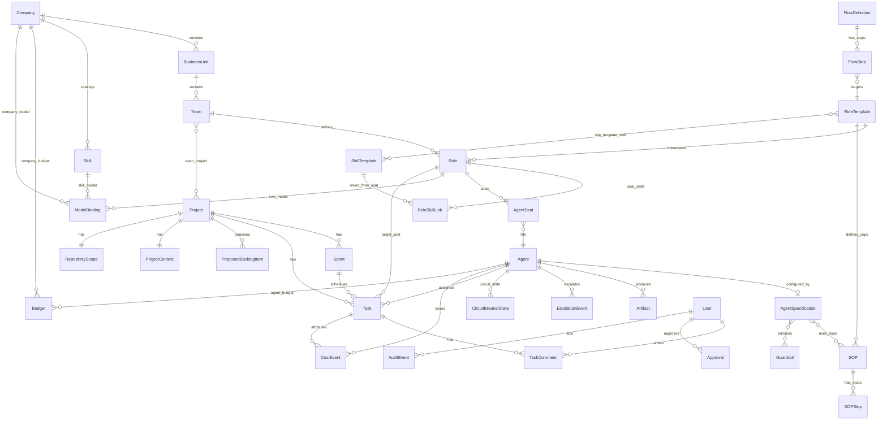

# Sarva — Design specification (consolidated)

**Audience:** Sarva-public baseline — architecture through runtime stack choices.  

This document merges what were separate **high-level**, **low-level**, and **technical specification** drafts. Optional split-doc copies may remain only on disk under **`Requirement/archive/`** (gitignored alongside this fork).

**Companion:** Canonical product behavior is in **`SARVA-REQUIREMENTS.md`**.

---

## Part I — Architecture (HLD)


## Sarva R1 — High-Level Design (HLD)

**Version:** 1.3.1  
**Status:** Draft  
**Authors:** *(program)*  
**Related BRD/FRD:** North-star **[`SARVA-REQUIREMENTS.md`](SARVA-REQUIREMENTS.md)** (phased R1 / agent-delivery scope summarized there and in §3 below); phased FRD lineage may exist only in a **local** **`Requirement/archive/`** clone.  
**Companion:** [`Sarva-R1-LLD.md`](#part-ii--detailed-design-lld) (component and data design **v1.6.0**)  
**Template basis:** [`templates/HLD-template.md`](templates/HLD-template.md)  

---

## 1. Purpose and scope

This HLD describes the **logical architecture** for **Sarva R1 — Agent project delivery**: **Phase 1** (lean delivery) and the **Phase 2** increment (CI/CD visibility and production promotion), at a level suitable for engineering breakdown and TSD/LLD detail.

**In scope:** Control-plane boundaries, major components, principal data flows, integrations, security posture, and technology constraints **as implied by the R1 FRD**.  
**Out of scope:** API schemas, database DDL, exact cloud topology, and operational runbooks (see **TSD** and [`Sarva-R1-LLD.md`](#part-ii--detailed-design-lld)).

**Traceability:** Maps to R1 §4–5 and parent SARVA-FR IDs listed in R1 §7.

---

## 2. Context

### 2.1 System context (C4 Level 1)

```text
                    ┌───────────────────────────────────────────────────────────────┐
  Operators /       │  Sarva R1 (single deployment = one "company" tenant)          │
  admins            │                                                               │
        │           │  ┌─────────────────────────────────────────────────────────┐  │
        └──────────►│  │ Control Plane UI                                        │  │
                    │  └─────────────────────────────┬───────────────────────────┘  │
                    │                                │                              │
                    │                                ▼                              │
                    │  ┌─────────────────────────────────────────────────────────┐  │
                    │  │ API + Orchestrator Agent (hub)                          │  │
                    │  │   • Routes tasks to specialized agents                  │  │
                    │  │   • Enforces guardrails                                 │  │
                    │  │   • Manages flows / SOPs                                │  │
                    │  │   • Collects artifacts                                  │  │
                    │  │   • Handles escalations                                 │  │
                    │  └──────┬──────┬──────┬──────┬──────┬──────────────────────┘  │
                    │         │      │      │      │      │                         │
                    │     ┌───┘   ┌──┘   ┌──┘   ┌──┘   ┌──┘                         │
                    │     ▼       ▼      ▼      ▼      ▼                            │
                    │  ┌─────┐ ┌─────┐ ┌─────┐ ┌─────┐ ┌─────┐                      │
                    │  │PM   │ │Eng  │ │Rev  │ │Sec  │ │Res  │  ← Specialized Agents│
                    │  │Agent│ │Agent│ │Agent│ │Agent│ │Agent│    (role-based)      │
                    │  └─────┘ └─────┘ └─────┘ └─────┘ └─────┘                      │
                    │                                                               │
                    │  • Persistence + audit                                        │
                    │  • Agent execution gateway                                    │
                    └───────┬───────────────┬───────────────────────────────────────┘
                            │               │
              MCP / API     │               │  Execution adapters
              (Git, …)      │               │  (process, HTTP, …)
                            ▼               ▼
                    ┌───────────────┐ ┌───────────────┐
                    │ Git hosting   │ │ LLM providers │
                    │ (e.g. GitHub) │ │ (BYOK/routed) │
                    └───────────────┘ └───────────────┘
```

- **Human actors:** Founder/lead, operators, admins (R1 **admin vs operator** RBAC; tiered partner RBAC deferred).  
- **Software actors:** **Orchestrator agent** (hub), **specialized agents** (PM, Engineer, Reviewer, Security, Research, etc.) per FRD **§4**.  
- **External systems:** **Git** (read/clone/link PR per Phase 1), **LLM APIs**, optional **Jira** (stub/absent in Phase 1). **Email** and full **chat** depth are out of scope for R1 Phase 1 per FRD.

### 2.3 Agent Orchestration Model (foundational)

Sarva's goal is to **run the company through a team of agents**. The orchestration model is **hub-and-spoke**:

```text
                              ┌────────────────────────┐
                              │   Orchestrator Agent   │
                              │        (hub)           │
                              │                        │
                              │ • Dispatch only        │
                              │ • Guardrail enforcement│
                              │ • Flow/SOP execution   │
                              │ • Artifact collection  │
                              │ • Escalation handling  │
                              └──┬──┬──┬──┬──┬──┬──┬───┘
                                 │  │  │  │  │  │  │
         ┌───────────────────────┘  │  │  │  │  │  └────────────────────────┐
         │        ┌────────────────┘  │  │  │  └─────────────────┐         │
         │        │         ┌─────────┘  │  └──────────┐         │         │
         ▼        ▼         ▼            ▼             ▼         ▼         ▼
   ┌──────────┐ ┌────────┐ ┌────────┐ ┌────────┐ ┌────────┐ ┌────────┐ ┌────────┐
   │   PM     │ │Engineer│ │Reviewer│ │Security│ │Research│ │ Design │ │  Doc   │
   │  Agent   │ │ Agent  │ │ Agent  │ │ Agent  │ │ Agent  │ │ Agent  │ │ Agent  │
   └──────────┘ └────────┘ └────────┘ └────────┘ └────────┘ └────────┘ └────────┘
        ↑            ↑          ↑          ↑          ↑          ↑          ↑
        └────────────┴──────────┴──────────┴──────────┴──────────┴──────────┘
                     Models configured via Admin → ModelBinding per agent
```

**Core principles (FRD §4.1):**

1. **Agents are role-based specialists** — each agent type maps to a **RoleTemplate** (PM, Engineer, Reviewer, etc.) with clear authority boundaries.
2. **Orchestrator dispatches, never executes** — the hub routes tasks, enforces guardrails, but does no direct work; agents cannot communicate peer-to-peer.
3. **Model assignment is user-configurable** — via **ModelBinding** in Admin UI; recommended practice is different models for reviewers vs implementers to prevent rubber-stamping bias.
4. **Rejection loops are capped** — default 2 cycles; on exceed → escalate to higher-tier agent or human.
5. **Security concerns bypass normal chain** — route directly to security agent.

**Key architectural components:**

| Component | Purpose | FRD reference |
|-----------|---------|---------------|
| **AgentSpecification** | Declarative config per agent: model, prompt, tools, skills, SOPs, guardrails | §4.2 |
| **Flow / Routing Engine** | Event-driven multi-step coordination; consults routing table per event | §4.3 |
| **Guardrail Engine** | Enforces scope, cross-role, action, escalation, and temporal guards | §4.4 |
| **SOP Executor** | Runs structured procedures with parameters, steps, output contracts | §4.5 |
| **Artifact Store** | Typed handoffs between agents; message envelope structure | §4.6 |
| **Escalation Manager** | Routes escalations per taxonomy (BLOCKED, AUTH_EXCEEDED, etc.) | §4.7 |
| **Circuit Breaker** | 3-strike halt: retry → different agent → human intervention | §4.4 |

**Model assignment (user-configurable via Admin → ModelBinding):**

All model assignments are **configurable by the user** through the Admin UI's **ModelBinding** system. The table below shows **recommended** tiers for guidance—users may choose any LLM provider and model supported by their deployment.

| Tier | Recommended characteristics | Rationale |
|------|----------------------------|-----------|
| Orchestrator | Cost-optimized, fast | Routing logic, high-frequency dispatch |
| Directors / PM | High-capability | Strategic thinking, nuanced decisions |
| Implementers (Engineer, Design, Doc) | High-capability | Creative generation, complex synthesis |
| Reviewers (Review, Security) | **Different model than implementers** | Avoids self-review bias; provides independent perspective |
| Analysts (Research, Scrum) | Cost-optimized | Read-heavy, high-volume queries |

**Key recommendation:** Use a **different model (or provider)** for Reviewers than for Implementers to prevent rubber-stamping bias.

### 2.2 Goals and quality attributes


| Attribute         | Target (R1)                                                                                                      |
| ----------------- | ---------------------------------------------------------------------------------------------------------------- |
| **Tenancy**       | **Single company** per deployment; isolation assumes single-tenant deployment model.                             |
| **Availability**  | Control plane **usable for daily delivery**; exact SLO TBD in TSD.                                               |
| **Security**      | RBAC for admin/operator; secrets for Git/LLM/adapters **not** in source; audit for material mutations (R1 §4.1). |
| **Scalability**   | Scale to **typical SMB team** workloads first; horizontal scaling of stateless tiers TBD in TSD.                 |
| **Observability** | Metrics/logs for agent runs, API errors, integration failures; correlation IDs (see LLD).                        |


---

## 3. Architecture overview

### 3.1 Logical components


| Component                        | Responsibility                                                                  | Notes                                                                                                                                                   |
| -------------------------------- | ------------------------------------------------------------------------------- | ------------------------------------------------------------------------------------------------------------------------------------------------------- |
| **Control plane UI**             | Org catalog, projects, sprints, board, tasks, costs, approvals, admin screens   | Aligns to UX mock `[mockups/sarva-r1-agent-delivery-mock.html](mockups/sarva-r1-agent-delivery-mock.html)`; styles in `[Design/](../Design/README.md)`. **R1:** **Sarva** **role/skill templates** (product catalog) + per-team **seat** allocation; intake → design notes → SDM drafts → plan/assign → board (see LLD **§3.1.0**). |
| **API / application service**    | AuthN/Z, CRUD for domain entities, orchestration entrypoints                    | REST or RPC **TSD**; versioned for clients.                                                                                                             |
| **Orchestrator Agent (hub)**     | Routes tasks to specialized agents; enforces guardrails; manages flows/SOPs; collects artifacts; handles escalations | FRD **§4**; **dispatch only** — never executes work directly; consults routing table and guardrail engine per dispatch. |
| **AgentSpec Registry**           | Stores and resolves **AgentSpecification** per agent: model, prompt, tools, skills, SOPs, guardrails | FRD **§4.2**; JSONB or linked entity; resolves model via **ModelBinding** hierarchy. |
| **Flow / Routing Engine**        | Event-driven multi-step coordination; routing table lookup; emits events for next dispatch | FRD **§4.3**; R1: propose → accept → assign → execute flow. |
| **Guardrail Engine**             | Enforces scope, cross-role, action, escalation, temporal guards before/after dispatch | FRD **§4.4**; circuit breaker (3-strike halt); minimum guardrails: GR-XRL-001 (no self-review), GR-ACT-001 (review read-only). |
| **SOP Executor**                 | Runs structured procedures with parameters, steps, output contracts, escalation triggers | FRD **§4.5**; R1 SOPs: `pm-agent-propose-backlog`, `engineer-agent-implement-task`, `review-agent-code-review`. |
| **Artifact Store**               | Typed handoffs between agents; message envelope validation; handoff paths | FRD **§4.6**; inline JSON or dedicated table; types: `proposed_task`, `code_change`, `review_verdict`, `security_verdict`, `design_document`. |
| **Escalation Manager**           | Routes escalations per taxonomy (BLOCKED, AUTH_EXCEEDED, GUARDRAIL, LOW_CONF, SCOPE_CREEP, SECURITY, TIMELINE) | FRD **§4.7**; consults escalation matrix (config). |
| **Work graph & scheduling**      | Backlog, sprint membership, **Task** lifecycle, **atomic claim**                | Core to SARVA-FR-131–132.                                                                                                                               |
| **PM Agent**                     | Proposes backlog items from requirements; follows `pm-agent-propose-backlog` SOP | SARVA-FR-145; accepted items become **Tasks** per **R1 FRD §5.1.3**. |
| **Engineer Agent**               | Implements tasks; emits `code.ready`; follows `engineer-agent-implement-task` SOP | SARVA-FR-138–143; model via **ModelBinding**. |
| **Reviewer Agent**               | Code review gate; emits `review.approved` or `review.rejected`; read-only | FRD **§4.4** GR-ACT-001; model via **ModelBinding** (recommend different from implementer). |
| **Security Agent**               | Security review; emits `security.approved` or `security.rejected`; bypasses normal escalation | FRD **§4.4** GR-ESC-002; model via **ModelBinding**. |
| **Research Agent**               | Investigation, code search, knowledge gathering | Read-heavy; model via **ModelBinding**. |
| **Integration gateway (MCP)**    | GitHub/Git operations: read, clone, **branch/PR** link aligned to **R1 FRD §5.1.1** | SARVA-FR-080–081, FR-147; **stub vs live** per **R1 FRD §10 Appendix B**. |
| **Execution adapter runtime**    | Invoke/cancel agent runs per adapter contract; optional **pre-push verification** in workspace before Git **push** (**R1 FRD §5.1.4**) | SARVA-FR-138–143; ≥1 category live Phase 1. |
| **Cost & budget service**        | Record cost events; rollups; enforce/alert vs budget                            | SARVA-FR-090–092.                                                                                                                                       |
| **Audit service**                | Append-only events for configured mutation classes                              | SARVA-FR-100–101 (R1 subset).                                                                                                                           |
| **Approval / governance (thin)** | **(a)** in-product inbox **or** **(b)** external gate — **one** per deployment; **designated approver** per project (**R1 FRD §5.1.2**); **TSD** implements states and notifications | SARVA-FR-060–063 subset. |
| **Persistence**                  | Relational or document store **TSD**; must support transactions for **claim**   | See LLD.                                                                                                                                                |


**Phase 2 additions:** **CI/CD visibility** component (pipeline read), **promotion** workflow integration (SARVA-FR-150, FR-061).

### 3.2 Deployment view (logical)

- **Default assumption:** **SaaS-style** or **single-tenant dedicated** deployment; **one logical “company”** per deployment in R1.  
- **Regions:** TBD (product).  
- **Secrets:** Managed via env/secret store; rotation plan **NFR-005** Phase 2 hardening.

---

## 4. Major data flows

### 4.1 Core flows

1. **Greenfield onboarding:** Operator creates **company** → **teams/roles/skills/model bindings** → **agents on seats** → **project** → **sprint** → **tasks** (R1 acceptance §5.3).
2. **Cost path:** Token/usage or adapter-reported cost → **cost event** → dashboards vs **budget** → alert/enforce per policy.

### 4.2 Agent orchestration flows

```text
┌──────────────────────────────────────────────────────────────────────────────────┐
│                         AGENT ORCHESTRATION FLOW                                 │
├──────────────────────────────────────────────────────────────────────────────────┤
│                                                                                  │
│  Human provides           Orchestrator           PM Agent           Human        │
│  requirements text   ─────────────────────► (propose SOP)   ──────────────►      │
│        │                      │                    │               accept/edit   │
│        │                      │                    │                    │        │
│        │                      ▼                    ▼                    ▼        │
│        │              ┌─────────────┐      ┌─────────────┐      ┌─────────────┐  │
│        └─────────────►│  Research   │ ───► │  Proposed   │ ───► │    Task     │  │
│                       │   Agent     │      │   Tasks     │      │  (backlog)  │  │
│                       └─────────────┘      └─────────────┘      └──────┬──────┘  │
│                                                                        │         │
│  ┌─────────────────────────────────────────────────────────────────────┘         │
│  │                                                                               │
│  ▼                                                                               │
│  Task claimed         Orchestrator           Engineer            code.ready      │
│  (in_progress)   ─────────────────────► (implement SOP)  ──────────────►         │
│        │                      │                    │                    │        │
│        │                      ▼                    ▼                    ▼        │
│        │              ┌─────────────┐      ┌─────────────┐      ┌─────────────┐  │
│        └─────────────►│  AgentSpec  │ ───► │   Code      │ ───► │  Artifact   │  │
│                       │  + Guardrails│     │  Changes    │      │ (handoff)   │  │
│                       └─────────────┘      └─────────────┘      └──────┬──────┘  │
│                                                                        │         │
│  ┌─────────────────────────────────────────────────────────────────────┘         │
│  │                                                                               │
│  ▼                                                                               │
│  code.ready           Orchestrator           Reviewer        review.approved/    │
│  event           ─────────────────────► (review SOP)   ────► rejected            │
│        │                      │                    │                    │        │
│        │                      ▼                    ▼                    ▼        │
│        │              ┌─────────────┐      ┌─────────────┐      ┌─────────────┐  │
│        └─────────────►│  Guardrail  │ ───► │   Review    │ ───► │  Verdict    │  │
│                       │  Check      │      │   Agent     │      │  Artifact   │  │
│                       └─────────────┘      └─────────────┘      └──────┬──────┘  │
│                                                                        │         │
│  ┌─────────────────────────────────────────────────────────────────────┘         │
│  │                                                                               │
│  ▼                                                                               │
│  If review.rejected     Orchestrator                          Rejection loop     │
│  (max 2 cycles)    ─────────────────────► Engineer Agent ────► (cap at 2)        │
│                                                                        │         │
│  If review.approved     Orchestrator           Security        security.approved/│
│  & security-relevant ────────────────────► (security SOP) ───► rejected          │
│                                                                        │         │
│  If security.approved   Orchestrator                                             │
│  or not relevant   ─────────────────────► Task → done ────► MCP Git push         │
│                                                                                  │
└──────────────────────────────────────────────────────────────────────────────────┘
```

3. **PM propose backlog:** Human provides **requirements text** and/or **link** → Orchestrator dispatches to **Research Agent** (investigate) → dispatches to **PM Agent** (propose SOP) → **ProposedTask** artifacts → human **accepts/edits** → **Tasks** meet **R1 FRD §5.1.3** → **product backlog** before sprint commit (SARVA-FR-145).

4. **Task execution (agent-centric):** Task **claimed** (atomic) → Orchestrator loads **AgentSpec** for target role → checks **Guardrails** → dispatches to **Engineer Agent** → Engineer follows **SOP** → emits `code.ready` → Orchestrator routes to **Reviewer Agent** (different model family) → review verdict → if `rejected` (max 2 cycles) → back to Engineer → if `approved` and security-relevant → **Security Agent** → final verdict → if `approved` → pre-push verify → MCP push → Task → done.

5. **Git association:** Project configured with **mode A or B** (TSD) → agent work targets a **feature branch** per **R1 FRD §5.1.1** → when enabled, **pre-push verification** (**§5.1.4**) in the workspace **before** remote **push** → MCP reads/refs/push path (TSD) → **Task** ↔ **branch/PR** when live.

6. **Escalation flow:** Agent emits `escalation_required: true` with **reason** (BLOCKED, AUTH_EXCEEDED, GUARDRAIL, LOW_CONF, SCOPE_CREEP, SECURITY, TIMELINE) → Orchestrator consults **escalation matrix** → routes to appropriate agent or human → if **circuit breaker** strike 3 → halt and report to human.

**Phase 2:** Pipeline events (webhook/poll) → attach status to **Task/Project/Release** records → promotion approval step.

---

## 5. Integrations


| External system                 | Direction | Protocol          | Phase 1                    | Phase 2                        |
| ------------------------------- | --------- | ----------------- | -------------------------- | ------------------------------ |
| **Git hosting (e.g. GitHub)**   | In/Out    | MCP / HTTPS / Git | Read, clone, link PR (min) | Webhooks, richer linking       |
| **LLM providers**               | Out       | HTTPS API         | BYOK or platform-routed    | Same                           |
| **Jira**                        | —         | REST (typical)    | Stub or absent             | Optional                       |
| **CI/CD (e.g. GitHub Actions)** | In        | API + webhooks    | **Defer**                  | Read-only status min. (FR-150) |
| **Email**                       | —         | —                 | **Defer**                  | Optional                       |


---

## 6. Security and compliance (high level)

- **Authentication:** Session or token-based for UI/API; **TSD** defines mechanism.  
- **Authorization:** **Admin** vs **operator** (R1); resource-scoped checks for projects/tasks/config.  
- **Data isolation:** Single tenant per deployment in R1; no cross-company data paths.  
- **Secrets:** Git tokens, LLM keys, adapter credentials in **secret store**; never committed.  
- **Audit:** Immutable log for Task/config/repo/approval/model-binding changes per R1 scope.

---

## 7. Technology constraints

- **Languages/frameworks:** **TSD** (e.g. TypeScript/Go/Python acceptable if aligned to team).  
- **Must-have behaviors:** Transactional **atomic claim**; idempotent webhooks where used; adapter contract per **SARVA-FR-142–143**.  
- **UI:** Web; responsive per mock breakpoints.

---

## 8. Open issues


| Topic                               | Owner          | Notes                                                                 |
| ----------------------------------- | -------------- | --------------------------------------------------------------------- |
| **Repo mode A vs B**                | Arch + product | **FRD constrains** Phase 1 to **one** association strategy (**§4.1** Git row; **§4.1.1** user story). **Open** = document chosen **A or B** in TSD and implement `RepositoryScope` accordingly. |
| **Single approval class**           | Product        | **FRD constrains** **(a)** inbox vs **(b)** external and **designated approver** (**§4.1.2**). **Open** = pick **one** high-value action class for Phase 1 (e.g. merge to main vs milestone release). |
| **PM orchestration implementation** | Eng            | **FRD constrains** propose → accept → **Task** with **§4.1.3** DoD. **Open** = LLM-only vs rules + LLM; async queue vs sync. |


---

## 9. Approval


| Role         | Name | Date |
| ------------ | ---- | ---- |
| Architecture |      |      |
| Security     |      |      |


---

## Document history


| Version | Date       | Notes                                                                |
| ------- | ---------- | -------------------------------------------------------------------- |
| 1.3.1   | 2026-04-18 | **§2.3** model assignment is user-configurable via ModelBinding (removed hardcoded model names); updated diagrams and tables; FRD **v1.2.1** |
| 1.3.0   | 2026-04-18 | **§2.3 Agent Orchestration Model** — hub-and-spoke, AgentSpec, Flow/Routing, Guardrail, SOP, Artifact, Escalation components; **§3.1** expanded with orchestrator + specialized agents; **§4** agent-centric flows; FRD **v1.2.0**; companion LLD **v1.6.0** |
| 1.2.3   | 2026-04-11 | **§3.1** control-plane row: Sarva templates + delivery UX path; FRD **v1.1.5**; companion LLD **v1.5.0** |
| 1.2.2   | 2026-04-11 | FRD **v1.1.4**; **§8** open-issue notes tied to FRD §4.1.x; companion LLD **v1.4.0** |
| 1.2.1   | 2026-04-11 | Companion LLD v1.3.0 (relational model, API illustrations) |
| 1.2.0   | 2026-04-11 | **§4.1.4** pre-push verification: execution adapter + flow 4; FRD v1.1.2, LLD v1.2.0 |
| 1.1.0   | 2026-04-11 | Align components and flows with R1 FRD §4.1.1–§4.1.3 and LLD v1.1.0 |
| 1.0.0   | 2026-04-11 | Initial R1 HLD aligned to Sarva-R1-Agent-Project-Delivery-FRD v1.0.0 |


---

*End of document*


---

## Part II — Detailed design (LLD)


## Sarva R1 — Low-Level Design (LLD)

**Version:** 1.6.0  
**Status:** Draft  
**Author:** *(program)*  
**Parent HLD:** [`Sarva-R1-HLD.md`](#part-i--architecture-hld) (**v1.3.0** — §2.3 Agent Orchestration Model)  
**Related FRD:** North-star **[`SARVA-REQUIREMENTS.md`](SARVA-REQUIREMENTS.md)**; historical phased FRD text may live only under **`Requirement/archive/`** locally (gitignored).  
**Template basis:** [`templates/LLD-template.md`](templates/LLD-template.md)  

---

## 1. Purpose and scope

This LLD specifies **interfaces**, **domain model**, **workflows**, and **operational** concerns for implementing **Sarva R1** per the R1 FRD and HLD. It is the **authoritative technical design** for R1 until superseded; the **canonical** machine-readable **OpenAPI 3.x** bundle and **migration source of truth** live in the **repo / TSD** (generated or hand-maintained).

**In scope:** Entity definitions, **relational FK model**, **illustrative** reference DDL and **illustrative** JSON request/response shapes (not a substitute for published OpenAPI), ORM mapping guidance, representative APIs, Task state machine, claim semantics, integration touchpoints, **named configuration keys**, errors, observability, testing focus.  
**Out of line:** Production **infrastructure-as-code**, and **Phase 2** CI/CD webhook **final** schemas (stub sections marked).

**Traceability:** SARVA-FR-131–133, 138–143, 145–149 (subset), R1 §4–5.

---

## 2. Interfaces

### 2.1 External APIs (application service)

Representative REST-style resources (prefix e.g. `/api/v1`). **TSD** finalizes paths, auth headers, and pagination.


| Resource area                           | Operations        | Notes                                                       |
| --------------------------------------- | ----------------- | ----------------------------------------------------------- |
| `Company`, `BusinessUnit`               | GET/PATCH         | Single company primary in R1; BU optional.                  |
| `Team`, `Role`, `Skill`, `ModelBinding` | CRUD              | Admin-gated; audit on binding changes. **R1:** `RoleTemplate` / `SkillTemplate` catalogs are **read** (seeded); team **seats** = `Role` rows; seat↔skill = `RoleSkillLink` → `SkillTemplate`. |
| `Agent`, `AgentSeat`                    | CRUD, status      | Idle/active/error; readiness gates simplified.              |
| `Project`, `ProjectContext`             | CRUD, PATCH       | Technical context: requirements links, repo scope (FR-146). |
| `Sprint`, `Task`                        | CRUD, transition  | Board columns map to Task states or `columnId`.             |
| `Task`                                  | `POST .../claim`  | **Atomic claim** (FR-132); returns 409 on conflict.         |
| `TaskComment`                           | CRUD              | FR-133.                                                     |
| `ProposedTask` / backlog draft          | POST from PM flow | Human accept → creates `Task` on backlog.                   |
| `CostEvent`, `Budget`                   | GET, ingest       | Dashboard aggregates.                                       |
| `Approval`                              | GET, act          | Thin single class in R1; **approver** resolves from **Project** `designatedApproverUserId` (or TSD default) per **R1 FRD §5.1.2**. |
| `Integration`, `ExecutionAdapter`       | CRUD              | FR-142–143; secrets redacted in GET. Optional **pre-push verify** steps per **R1 FRD §5.1.4**. |
| `AuditEvent`                            | GET (filtered)    | Immutable stream.                                           |


**Webhooks (Phase 2):** `POST /api/v1/webhooks/ci` (secured) — pipeline status updates.

### 2.2 Dependencies


| Dependency            | Used by                     | Notes                               |
| --------------------- | --------------------------- | ----------------------------------- |
| **Database**          | All durable entities        | Transactions for claim + audit row. |
| **MCP / Git client**  | Integration gateway         | Timeouts: **`MCP_GIT_*`** in §5 / §8. |
| **LLM HTTP API**      | PM orchestrator, agent runs | Model IDs from binding resolution.  |
| **Execution adapter** | Agent runtime               | Process or HTTP per adapter config. |


### 2.3 API contracts (illustrative JSON shapes)

**Normative** API surface: **OpenAPI 3.x** (or gRPC Proto) maintained in the **implementation repo** / **TSD**. Below are **illustrative** request/response bodies for key flows so backend and clients can align before the spec is published.

**`POST /api/v1/tasks/{taskId}/claim`**

Request:

```json
{
  "assigneeAgentId": "550e8400-e29b-41d4-a716-446655440000",
  "expectedVersion": 3
}
```

Response `200`:

```json
{
  "task": {
    "id": "…",
    "projectId": "…",
    "state": "in_progress",
    "assigneeAgentId": "550e8400-e29b-41d4-a716-446655440000",
    "version": 4
  }
}
```

Response `409` (atomic claim conflict):

```json
{
  "error": {
    "code": "TASK_CLAIM_CONFLICT",
    "message": "Task already claimed or state changed",
    "details": { "taskId": "…" }
  }
}
```

**`GET /api/v1/tasks?projectId={uuid}&state=in_progress&limit=…`**

Response `200`:

```json
{
  "items": [
    {
      "id": "…",
      "projectId": "…",
      "title": "…",
      "description": "…",
      "state": "in_progress",
      "priority": "P1",
      "linkedBranch": "feature/task-…",
      "linkedPrUrl": "https://…"
    }
  ],
  "nextCursor": null
}
```

**`PATCH /api/v1/tasks/{taskId}`** (partial update — state and/or **target seat**)

Request:

```json
{
  "state": "review",
  "expectedVersion": 4
}
```

Request (assign **target role** / seat only):

```json
{
  "targetRoleId": "550e8400-e29b-41d4-a716-446655440000",
  "expectedVersion": 4
}
```

**`POST /api/v1/projects`** (create — subset of fields)

Request:

```json
{
  "name": "Nimbus API",
  "repoAssociationMode": "dedicated_repo",
  "designatedApproverUserId": null,
  "governanceMode": "inbox"
}
```

---

## 3. Data model (detailed)

### 3.1 Entities / tables / documents

Logical model (physical types TSD). IDs are UUIDs unless noted.

#### 3.1.0 R1 alignment: Sarva role/skill **templates** vs north-star “custom catalog”

The **north-star** requirements (**[`SARVA-REQUIREMENTS.md`](SARVA-REQUIREMENTS.md)** §3.1) calls for **prebuilt and custom** roles and skills with full **Admin CRUD** on catalog entries. **R1 implementation** (this repo) uses a **template-first** model that **satisfies the same onboarding journey** (assign roles to teams → attach skills → bind models → agents → projects) while deferring **tenant-authored custom role/skill definitions** to a later increment:

| Concept | North-star intent | R1 implementation |
|--------|-------------------|-------------------|
| **Role types** (Engineer, QA, PM, …) | Prebuilt + custom in tenant catalog | **`RoleTemplate`** — product-seeded **Sarva** catalog (fixed set); teams allocate **headcount** per template → one **`Role` row per seat** (named instance, e.g. “Engineer 2”). |
| **Skills** (Coder, reviewer, …) | Prebuilt + custom | **`SkillTemplate`** — product-seeded catalog; **`RoleTemplateSkill`** defines which skills each **role type** may use; each **seat** links skills via **`RoleSkillLink`** → `SkillTemplate`. |
| **Company `Skill` row** | Tenant-defined skills | **Retained** for **polymorphic `ModelBinding`** (company/role/skill scope) and optional legacy paths; **not** the primary seat↔skill link in R1. |
| **Task routing** | IC agents + skills | Optional **`Task.targetRoleId`** → **`Role`** (seat) for human-visible assignment before agent **claim**; aligns with FR-131–133 execution story. |

**UI flow (control plane):** **Intake** (requirement + context) → **Design** (`ProjectContext.analysisNotes`) → **SDM** (PM text → proposed backlog drafts) → **Plan & assign** (accept → `Task`, assign seat) → **Board**. This matches R1 FRD **§5.1** backlog and **§5.1.3** DoD without requiring full north-star **§8.5** gated approval chain in Phase 1.

### 3.1.1 SDLC extensions (goals, phase, SDM/TPM assignments, design artifacts)

| Artifact | Purpose |
| -------- | ------- |
| **`ProjectContext.goals`**, **`document_repository_url`** | Plain-text goals and an optional second “doc” URL (wiki, Confluence, extra git remote). **`requirements_links`** JSON may store `{ label?, url }` rows for a form-based UI; still merged into PM propose context. |
| **`Project.delivery_phase`** | Nullable lifecycle hint: `intake` → `design` → `delivery` → `sustain`. Used for UI/tabs; not a hard workflow gate in R1 unless extended. |
| **`ProjectRoleAssignment`** | `(project_id, duty, agent_id)` with **`duty`** ∈ `sdm_delivery`, `tpm_sprint` and **unique (`project_id`, `duty`)**. Assigns which **Agent** plays SDM vs TPM narrative on the project. **PM** orchestrator remains **`Project.pm_orchestrator_agent_id`**. REST: `GET`/`PUT /api/v1/projects/:projectId/role-assignments`. |
| **`DesignArtifact`** | Lightweight design record: `title`, `body`, `status` (`draft` \| `approved`). REST: `GET`/`POST /api/v1/projects/:projectId/design-artifacts`, `PATCH /api/v1/design-artifacts/:artifactId`. Future work may FK tasks to artifacts. |

**PM propose intelligence:** `POST /api/v1/projects/:projectId/pm/propose` loads **`ProjectContext`** and **`RepositoryScope`** and **appends** that context to each draft (line-split mode). If the client sends **`useLlm: true`** and the server has **`PM_PROPOSE_USE_LLM=true`**, **`OPENAI_API_KEY`**, and a **Company** row, the API calls the OpenAI Chat Completions HTTP API using the **lowest `priority`** company-scoped **`ModelBinding.model_id`** (fallback `gpt-4o-mini`). Deterministic line-split remains the default.

### 3.1.2 Agent Orchestration entities (FRD §4)

These entities support the hub-and-spoke multi-agent orchestration model per FRD **§4**.

| Entity | Purpose | FRD ref |
|--------|---------|---------|
| **AgentSpecification** | Declarative config for an agent: model, system prompt, allowed tools, skills, SOPs, guardrails | §4.2 |
| **FlowDefinition** | Multi-step coordination pattern with routing table | §4.3 |
| **FlowStep** | Individual step in a flow with event, target agent, conditions | §4.3 |
| **Guardrail** | Configurable rule enforced by orchestrator (scope, cross-role, action, escalation, temporal) | §4.4 |
| **SOP** | Standard operating procedure with parameters, steps, output contract, escalation triggers | §4.5 |
| **SOPStep** | Individual step within an SOP | §4.5 |
| **Artifact** | Typed handoff between agents with message envelope | §4.6 |
| **EscalationEvent** | Recorded escalation with reason, source agent, target, resolution | §4.7 |

---

| Name                    | Key fields                                                                                      | Keys / constraints                                | Notes                                       |
| ----------------------- | ----------------------------------------------------------------------------------------------- | ------------------------------------------------- | ------------------------------------------- |
| **Company**             | `id`, `name`, `settings`                                                                        | PK `id`                                           | Single row typical in R1.                   |
| **BusinessUnit**        | `id`, `companyId`, `name`                                                                       | PK; FK `companyId`                                | Optional.                                   |
| **Team**                | `id`, `buId?`, `name`, `charter`                                                                | PK; FK `buId` → **BusinessUnit**                  | Created with **composition**: headcount per **`RoleTemplate`**. |
| **TeamProject**         | `teamId`, `projectId`                                                                           | Composite PK; FKs → **Team**, **Project**         | M:N junction.                               |
| **User**                | `id`, `email`, …                                                                                | PK                                                | Auth **TSD**; **TaskComment** / audit actor |
| **RoleTemplate**        | `id`, `code`, `label`, `description?`, `sortOrder`                                               | PK; `code` unique                                 | **Sarva** product catalog (seeded).         |
| **SkillTemplate**       | `id`, `code`, `label`, `description?`, `sortOrder`                                             | PK; `code` unique                                 | **Sarva** product catalog (seeded).         |
| **RoleTemplateSkill**   | `roleTemplateId`, `skillTemplateId`                                                              | Composite PK; FKs → **RoleTemplate**, **SkillTemplate** | Allowed skills **per role type** (validation for links). |
| **Role**                | `id`, `teamId`, `name`, **`roleTemplateId?`**                                                    | PK; FK `teamId` → **Team**; FK `roleTemplateId` → **RoleTemplate** | One row = **one seat** on the team (instance of a template). |
| **Skill**               | `id`, `companyId`, `name`                                                                      | PK; FK `companyId` → **Company**                  | Optional **tenant** rows for **`ModelBinding.skill`** scope; not used for seat↔skill in R1 primary path. |
| **RoleSkillLink**       | `roleId`, `skillTemplateId`                                                                    | Composite PK; FKs → **Role**, **SkillTemplate**    | Skills attached to a **seat** (replaces prior **`RoleSkill`** → company `Skill` for R1 UX). |
| **ModelBinding**        | `id`, `scopeType` (role \| skill \| company), `scopeId?`, `modelId`, `priority` | PK | Resolution order **§4.4**. |
| **Agent**               | `id`, `name`, `status`                                                                          | PK                                                | **No** direct `seatId`; assignment is **`AgentSeat.assignedAgentId` → Agent** (single source of truth). |
| **AgentSeat**           | `id`, `roleId`, `assignedAgentId?`, `label?`                                                    | PK; FK `roleId` → **Role**; FK `assignedAgentId` → **Agent** | One **seat** per **Role**; optional **label**; **at most one** agent per seat (**TSD** may add `UNIQUE` on `assigned_agent_id` when set). |
| **Project**             | `id`, `name`, `pmOrchestratorAgentId`, `repoAssociationMode`, `designatedApproverUserId?`, `governanceMode?` (inbox \| external), `deliveryPolicy?` (JSON: prePushVerify enabled/steps/onFailure) | PK; FKs see §3.3 | **§5.1.4** / **§5.1.2**; `pmOrchestratorAgentId` → **Agent**, `designatedApproverUserId` → **User**. |
| **ProjectContext**      | `projectId`, `requirementsLinks[]`, `repoScope`, `brief`, **`analysisNotes?`**                  | PK `projectId`; FK → **Project** (1:1)            | FR-146; **analysisNotes** = design/analysis step before SDM task breakdown. |
| **RepositoryScope**     | `projectId`, `cloneUrl?`, `rootPath?`, `branchDefault?`                                         | PK `projectId`; FK → **Project** (1:1)            | Depends on mode A/B.                        |
| **Sprint**              | `id`, `projectId`, `name`, `start`, `end`                                                       | PK; FK `projectId` → **Project**                  |                                             |
| **Task**                | `id`, `projectId`, `sprintId?`, `title`, `description` (Markdown), `state`, `assigneeAgentId?`, **`targetRoleId?`**, `skillTags[]`, `priority`, `linkedBranch?`, `linkedPrUrl?`, `version` | PK; FK `targetRoleId` → **Role** (SET NULL); unique claim lock; FKs see §3.3 | **§5.1.3**; optional **target seat** before agent claim; **version** for optimistic concurrency (**§4.2**). |
| **TaskComment**         | `id`, `taskId`, `authorId`, `body`, `createdAt`                                                 | PK; FK `taskId` → **Task**, `authorId` → **User** |                                             |
| **ProposedBacklogItem** | `id`, `projectId`, `source` (text \| link), `payload`, `status` (draft \| accepted \| rejected) | PK; FK `projectId` → **Project** | Draft until accept → **Task** per **R1 FRD §5.1.3**. |
| **CostEvent**           | `id`, `agentId?`, `taskId?`, `amount`, `unit`, `occurredAt`                                     | PK; FK `agentId` → **Agent**, `taskId` → **Task**  |                                             |
| **Budget**              | `id`, `scope` (company \| agent), `scopeId?`, `monthlyCap`, `policy` (alert \| block) | PK | |
| **Approval**            | `id`, `type`, `subjectRef`, `state`, `approverUserId?`, `createdAt` | PK | **approverUserId** aligns with **Project.designatedApproverUserId** when inbox **(a)**; **TSD** if external **(b)**. |
| **ExecutionAdapter**    | `id`, `type`, `config` (encrypted blob ref), `enabled`                                          | PK                                                | May include **verify** hooks ordering before push (**§5.1.4**). |
| **AuditEvent**          | `id`, `actorId`, `action`, `resourceRef`, `payloadHash`, `createdAt`                            | Append-only                                       |                                             |
| **AgentSpecification**  | `id`, `agentId`, `modelOverride?`, `systemPrompt`, `allowedTools[]`, `skillCodes[]`, `sopCodes[]`, `guardrailCodes[]`, `knowledgeBase?` | PK; FK `agentId` → **Agent** (1:1 or nullable) | FRD **§4.2**; declarative config per agent; `modelOverride` takes precedence over **ModelBinding**. |
| **FlowDefinition**      | `id`, `code`, `name`, `description?`, `isActive`                                               | PK; `code` unique                                 | FRD **§4.3**; multi-step coordination pattern. |
| **FlowStep**            | `id`, `flowId`, `eventName`, `targetRoleTemplateCode`, `conditions?` (JSON), `order`           | PK; FK `flowId` → **FlowDefinition**              | Routing table entry; e.g. `code.ready` → `reviewer` role. |
| **Guardrail**           | `id`, `code`, `category` (scope \| cross_role \| action \| escalation \| temporal), `rule` (JSON), `action` (block \| escalate \| warn), `isActive` | PK; `code` unique | FRD **§4.4**; e.g. `GR-XRL-001` = no self-review. |
| **SOP**                 | `id`, `code`, `name`, `roleTemplateCode`, `parameters[]` (JSON schema), `outputContract` (JSON schema), `escalationTriggers[]`, `handoffRoles[]` | PK; `code` unique; FK `roleTemplateCode` → **RoleTemplate** | FRD **§4.5**; e.g. `pm-agent-propose-backlog`. |
| **SOPStep**             | `id`, `sopId`, `order`, `action`, `constraints?` (JSON), `expectedOutput?`                     | PK; FK `sopId` → **SOP**                          | Ordered steps within an SOP. |
| **Artifact**            | `id`, `type` (proposed_task \| code_change \| review_verdict \| security_verdict \| design_document), `producerAgentId`, `consumerAgentId?`, `taskId?`, `payload` (JSONB), `envelope` (JSONB), `createdAt` | PK; FKs → **Agent**, **Task** | FRD **§4.6**; `envelope` contains status, summary, escalation fields. |
| **EscalationEvent**     | `id`, `sourceAgentId`, `reason` (BLOCKED \| AUTH_EXCEEDED \| GUARDRAIL \| LOW_CONF \| SCOPE_CREEP \| SECURITY \| TIMELINE), `targetRoleTemplateCode?`, `targetUserId?`, `resolution?`, `taskId?`, `createdAt` | PK; FKs → **Agent**, **User**, **Task** | FRD **§4.7**; audit trail for escalations. |
| **CircuitBreakerState** | `agentId`, `taskId`, `strikeCount`, `lastFailureReason?`, `lastStrikeAt`                       | Composite PK; FKs → **Agent**, **Task**           | FRD **§4.4**; 3-strike halt mechanism. |


**Indexes (minimum):** `Task(projectId, state)`, `Task(assigneeAgentId)`, `Task(id, version)` (claim), `Skill(companyId)`, `AuditEvent(createdAt)`, `CostEvent(occurredAt)`.

### 3.2 Migrations / versioning

- **Forward-only** migrations; `api/v1` frozen per release; deprecate with headers per TSD.  
- **Claim** migration: ensure DB constraint or `SELECT … FOR UPDATE` equivalent documented in TSD.

### 3.3 Relational integrity (foreign keys)

**Polymorphic references:** **ModelBinding** (`scopeType` + `scopeId`) and **Budget** (`scope` + `scopeId`) reference different parent tables per enum — enforce in application layer or use **PostgreSQL** `CHECK` + separate nullable FK columns per **TSD**; not all DBs support generic polymorphic FKs.

| Child | Foreign key column(s) | Parent | Typical ON DELETE |
|-------|------------------------|--------|-------------------|
| business_unit | company_id | company | CASCADE |
| team | business_unit_id | business_unit | SET NULL |
| team_project | team_id, project_id | team, project | CASCADE |
| role | team_id | team | CASCADE |
| role | role_template_id | role_template | SET NULL |
| skill | company_id | company | CASCADE |
| role_skill_link | role_id, skill_template_id | role, skill_template | CASCADE |
| agent_seat | role_id | role | CASCADE |
| agent_seat | assigned_agent_id | agent | SET NULL |
| model_binding | (polymorphic) | role / skill / company | TSD |
| task | project_id | project | CASCADE |
| task | sprint_id | sprint | SET NULL |
| task | assignee_agent_id | agent | SET NULL |
| task | target_role_id | role | SET NULL |
| task_comment | task_id, author_id | task, user | CASCADE / RESTRICT |
| proposed_backlog_item | project_id | project | CASCADE |
| sprint | project_id | project | CASCADE |
| project | pm_orchestrator_agent_id | agent | SET NULL |
| project | designated_approver_user_id | user | SET NULL |
| project_context | project_id | project | CASCADE |
| repository_scope | project_id | project | CASCADE |
| cost_event | agent_id, task_id | agent, task | SET NULL |
| approval | approver_user_id | user | SET NULL |
| audit_event | actor_id | user | RESTRICT |
| budget | company_id / agent_id (polymorphic) | company / agent | CASCADE / SET NULL |
| agent_specification | agent_id | agent | CASCADE |
| flow_step | flow_id | flow_definition | CASCADE |
| sop | role_template_code | role_template | SET NULL |
| sop_step | sop_id | sop | CASCADE |
| artifact | producer_agent_id, consumer_agent_id, task_id | agent, agent, task | SET NULL |
| escalation_event | source_agent_id, target_user_id, task_id | agent, user, task | SET NULL |
| circuit_breaker_state | agent_id, task_id | agent, task | CASCADE |

### 3.4 Entity-relationship diagram (conceptual)



**Note:** **ExecutionAdapter** is a **standalone** config entity in R1 LLD; optional FK to **Company** (or deployment singleton) is **TSD**.

### 3.5 Reference DDL (illustrative PostgreSQL)

**Non-normative.** Final column types, extensions (`uuid-ossp` / `pgcrypto`), partial indexes, and **polymorphic** enforcement belong in **migrations** / **TSD**. Implementations may use **Prisma**, **TypeORM**, **Drizzle**, etc., generated from the same logical model. Below, **`model_binding`** uses nullable FK columns plus a **`CHECK`** so exactly **one** scope applies.

**LLD v1.6.0:** The **authoritative** DDL for **`role_template`**, **`skill_template`**, **`role_template_skill`**, **`role_skill_link`**, and columns **`role.role_template_id`**, **`project_context.analysis_notes`**, **`task.target_role_id`** is in **repository migrations** (`apps/api/prisma/migrations/`). The script below remains a **baseline** illustration; replace `role_skill` with `role_skill_link` + templates when reconciling old snippets.

```sql
-- Illustrative only — dependency order matches §3.3
CREATE TABLE company (
  id         UUID PRIMARY KEY,
  name       TEXT NOT NULL,
  settings   JSONB NOT NULL DEFAULT '{}'
);

CREATE TABLE business_unit (
  id         UUID PRIMARY KEY,
  company_id UUID NOT NULL REFERENCES company(id) ON DELETE CASCADE,
  name       TEXT NOT NULL
);

CREATE TABLE "user" (
  id    UUID PRIMARY KEY,
  email TEXT NOT NULL UNIQUE
);

CREATE TABLE agent (
  id     UUID PRIMARY KEY,
  name   TEXT NOT NULL,
  status TEXT NOT NULL
);

CREATE TABLE skill (
  id          UUID PRIMARY KEY,
  company_id  UUID NOT NULL REFERENCES company(id) ON DELETE CASCADE,
  name        TEXT NOT NULL
);

CREATE TABLE team (
  id                UUID PRIMARY KEY,
  business_unit_id  UUID REFERENCES business_unit(id) ON DELETE SET NULL,
  name              TEXT NOT NULL,
  charter           TEXT
);

CREATE TABLE role (
  id      UUID PRIMARY KEY,
  team_id UUID NOT NULL REFERENCES team(id) ON DELETE CASCADE,
  name    TEXT NOT NULL
);

CREATE TABLE role_skill (
  role_id   UUID NOT NULL REFERENCES role(id) ON DELETE CASCADE,
  skill_id  UUID NOT NULL REFERENCES skill(id) ON DELETE CASCADE,
  PRIMARY KEY (role_id, skill_id)
);

CREATE TABLE agent_seat (
  id                  UUID PRIMARY KEY,
  role_id             UUID NOT NULL REFERENCES role(id) ON DELETE CASCADE,
  assigned_agent_id   UUID REFERENCES agent(id) ON DELETE SET NULL,
  label               TEXT
);

CREATE TABLE model_binding (
  id          UUID PRIMARY KEY,
  company_id  UUID REFERENCES company(id) ON DELETE CASCADE,
  role_id     UUID REFERENCES role(id) ON DELETE CASCADE,
  skill_id    UUID REFERENCES skill(id) ON DELETE CASCADE,
  model_id    TEXT NOT NULL,
  priority    INTEGER NOT NULL DEFAULT 0,
  CONSTRAINT model_binding_one_scope CHECK (
    (company_id IS NOT NULL AND role_id IS NULL AND skill_id IS NULL) OR
    (company_id IS NULL AND role_id IS NOT NULL AND skill_id IS NULL) OR
    (company_id IS NULL AND role_id IS NULL AND skill_id IS NOT NULL)
  )
);

CREATE TABLE project (
  id                          UUID PRIMARY KEY,
  name                        TEXT NOT NULL,
  repo_association_mode       TEXT NOT NULL,
  pm_orchestrator_agent_id    UUID REFERENCES agent(id) ON DELETE SET NULL,
  designated_approver_user_id UUID REFERENCES "user"(id) ON DELETE SET NULL,
  governance_mode             TEXT,
  delivery_policy             JSONB
);

CREATE TABLE project_context (
  project_id          UUID PRIMARY KEY REFERENCES project(id) ON DELETE CASCADE,
  requirements_links  JSONB NOT NULL DEFAULT '[]',
  repo_scope          TEXT,
  brief               TEXT
);

CREATE TABLE repository_scope (
  project_id     UUID PRIMARY KEY REFERENCES project(id) ON DELETE CASCADE,
  clone_url      TEXT,
  root_path      TEXT,
  branch_default TEXT
);

CREATE TABLE sprint (
  id         UUID PRIMARY KEY,
  project_id UUID NOT NULL REFERENCES project(id) ON DELETE CASCADE,
  name       TEXT NOT NULL,
  starts_at  TIMESTAMPTZ,
  ends_at    TIMESTAMPTZ
);

CREATE TABLE task (
  id                UUID PRIMARY KEY,
  project_id        UUID NOT NULL REFERENCES project(id) ON DELETE CASCADE,
  sprint_id         UUID REFERENCES sprint(id) ON DELETE SET NULL,
  title             TEXT NOT NULL,
  description       TEXT,
  state             TEXT NOT NULL,
  assignee_agent_id UUID REFERENCES agent(id) ON DELETE SET NULL,
  skill_tags        TEXT[] NOT NULL DEFAULT '{}',
  priority          TEXT,
  linked_branch     TEXT,
  linked_pr_url     TEXT,
  version           INTEGER NOT NULL DEFAULT 1
);

CREATE TABLE team_project (
  team_id    UUID NOT NULL REFERENCES team(id) ON DELETE CASCADE,
  project_id UUID NOT NULL REFERENCES project(id) ON DELETE CASCADE,
  PRIMARY KEY (team_id, project_id)
);

CREATE TABLE task_comment (
  id         UUID PRIMARY KEY,
  task_id    UUID NOT NULL REFERENCES task(id) ON DELETE CASCADE,
  author_id  UUID NOT NULL REFERENCES "user"(id) ON DELETE RESTRICT,
  body       TEXT NOT NULL,
  created_at TIMESTAMPTZ NOT NULL DEFAULT now()
);

CREATE TABLE proposed_backlog_item (
  id          UUID PRIMARY KEY,
  project_id  UUID NOT NULL REFERENCES project(id) ON DELETE CASCADE,
  source      TEXT NOT NULL,
  payload     JSONB NOT NULL,
  status      TEXT NOT NULL
);

CREATE TABLE cost_event (
  id          UUID PRIMARY KEY,
  agent_id    UUID REFERENCES agent(id) ON DELETE SET NULL,
  task_id     UUID REFERENCES task(id) ON DELETE SET NULL,
  amount      NUMERIC NOT NULL,
  unit        TEXT NOT NULL,
  occurred_at TIMESTAMPTZ NOT NULL DEFAULT now()
);

CREATE TABLE budget (
  id          UUID PRIMARY KEY,
  scope       TEXT NOT NULL CHECK (scope IN ('company', 'agent')),
  company_id  UUID REFERENCES company(id) ON DELETE CASCADE,
  agent_id    UUID REFERENCES agent(id) ON DELETE CASCADE,
  monthly_cap NUMERIC,
  policy      TEXT NOT NULL DEFAULT 'alert',
  CONSTRAINT budget_one_scope CHECK (
    (scope = 'company' AND company_id IS NOT NULL AND agent_id IS NULL) OR
    (scope = 'agent' AND agent_id IS NOT NULL AND company_id IS NULL)
  )
);

CREATE TABLE approval (
  id                 UUID PRIMARY KEY,
  type               TEXT NOT NULL,
  subject_ref        TEXT NOT NULL,
  state              TEXT NOT NULL,
  approver_user_id   UUID REFERENCES "user"(id) ON DELETE SET NULL,
  created_at         TIMESTAMPTZ NOT NULL DEFAULT now()
);

CREATE TABLE execution_adapter (
  id       UUID PRIMARY KEY,
  type     TEXT NOT NULL,
  config   JSONB NOT NULL DEFAULT '{}',
  enabled  BOOLEAN NOT NULL DEFAULT true
);

CREATE TABLE audit_event (
  id            UUID PRIMARY KEY,
  actor_id      UUID NOT NULL REFERENCES "user"(id) ON DELETE RESTRICT,
  action        TEXT NOT NULL,
  resource_ref  TEXT NOT NULL,
  payload_hash  TEXT,
  created_at    TIMESTAMPTZ NOT NULL DEFAULT now()
);

-- Agent Orchestration entities (FRD §4)

CREATE TABLE agent_specification (
  id               UUID PRIMARY KEY,
  agent_id         UUID REFERENCES agent(id) ON DELETE CASCADE,
  model_override   TEXT,
  system_prompt    TEXT NOT NULL,
  allowed_tools    TEXT[] NOT NULL DEFAULT '{}',
  skill_codes      TEXT[] NOT NULL DEFAULT '{}',
  sop_codes        TEXT[] NOT NULL DEFAULT '{}',
  guardrail_codes  TEXT[] NOT NULL DEFAULT '{}',
  knowledge_base   JSONB
);

CREATE TABLE flow_definition (
  id          UUID PRIMARY KEY,
  code        TEXT NOT NULL UNIQUE,
  name        TEXT NOT NULL,
  description TEXT,
  is_active   BOOLEAN NOT NULL DEFAULT true
);

CREATE TABLE flow_step (
  id                       UUID PRIMARY KEY,
  flow_id                  UUID NOT NULL REFERENCES flow_definition(id) ON DELETE CASCADE,
  event_name               TEXT NOT NULL,
  target_role_template_code TEXT NOT NULL,
  conditions               JSONB,
  step_order               INTEGER NOT NULL
);

CREATE TABLE guardrail (
  id        UUID PRIMARY KEY,
  code      TEXT NOT NULL UNIQUE,
  category  TEXT NOT NULL CHECK (category IN ('scope', 'cross_role', 'action', 'escalation', 'temporal')),
  rule      JSONB NOT NULL,
  action    TEXT NOT NULL CHECK (action IN ('block', 'escalate', 'warn')),
  is_active BOOLEAN NOT NULL DEFAULT true
);

CREATE TABLE sop (
  id                   UUID PRIMARY KEY,
  code                 TEXT NOT NULL UNIQUE,
  name                 TEXT NOT NULL,
  role_template_code   TEXT,
  parameters           JSONB NOT NULL DEFAULT '[]',
  output_contract      JSONB NOT NULL DEFAULT '{}',
  escalation_triggers  TEXT[] NOT NULL DEFAULT '{}',
  handoff_roles        TEXT[] NOT NULL DEFAULT '{}'
);

CREATE TABLE sop_step (
  id              UUID PRIMARY KEY,
  sop_id          UUID NOT NULL REFERENCES sop(id) ON DELETE CASCADE,
  step_order      INTEGER NOT NULL,
  action          TEXT NOT NULL,
  constraints     JSONB,
  expected_output TEXT
);

CREATE TABLE artifact (
  id                 UUID PRIMARY KEY,
  type               TEXT NOT NULL CHECK (type IN ('proposed_task', 'code_change', 'review_verdict', 'security_verdict', 'design_document')),
  producer_agent_id  UUID REFERENCES agent(id) ON DELETE SET NULL,
  consumer_agent_id  UUID REFERENCES agent(id) ON DELETE SET NULL,
  task_id            UUID REFERENCES task(id) ON DELETE SET NULL,
  payload            JSONB NOT NULL,
  envelope           JSONB NOT NULL,
  created_at         TIMESTAMPTZ NOT NULL DEFAULT now()
);

CREATE TABLE escalation_event (
  id                        UUID PRIMARY KEY,
  source_agent_id           UUID REFERENCES agent(id) ON DELETE SET NULL,
  reason                    TEXT NOT NULL CHECK (reason IN ('BLOCKED', 'AUTH_EXCEEDED', 'GUARDRAIL', 'LOW_CONF', 'SCOPE_CREEP', 'SECURITY', 'TIMELINE')),
  target_role_template_code TEXT,
  target_user_id            UUID REFERENCES "user"(id) ON DELETE SET NULL,
  resolution                TEXT,
  task_id                   UUID REFERENCES task(id) ON DELETE SET NULL,
  created_at                TIMESTAMPTZ NOT NULL DEFAULT now()
);

CREATE TABLE circuit_breaker_state (
  agent_id            UUID NOT NULL REFERENCES agent(id) ON DELETE CASCADE,
  task_id             UUID NOT NULL REFERENCES task(id) ON DELETE CASCADE,
  strike_count        INTEGER NOT NULL DEFAULT 0,
  last_failure_reason TEXT,
  last_strike_at      TIMESTAMPTZ,
  PRIMARY KEY (agent_id, task_id)
);
```

### 3.6 ORM mapping (Prisma / TypeORM / equivalent)

- **One logical entity** in §3.1 maps to **one** persisted model / table (or embedded JSON column where noted, e.g. `delivery_policy`).
- **Migrations** are the **source of truth** for drift detection; ORM schema should be **generated** from migrations or **verified** in CI (`prisma migrate diff`, etc.) per **TSD**.
- **Naming:** Default **snake_case** in SQL, **camelCase** in TS/JS DTOs with explicit mapping at the API boundary.
- **Junction:** `TeamProject` ↔ `team_project`; **`AgentSeat`** ↔ `agent_seat` (role seat ↔ optional **Agent**).

---

## 4. Algorithms and workflows

### 4.1 Task state machine (Phase 1)

States (example): `backlog` → `todo` → `in_progress` → `review` → `done` (+ `cancelled`).  
**Board columns** may map 1:1 to states or use `columnId` enum; product choice recorded in TSD.

### 4.2 Atomic claim (SARVA-FR-132)

**Algorithm:**

1. Client requests transition to `in_progress` with `assigneeAgentId = A`.
2. Server opens **transaction**.
3. `UPDATE task SET state = 'in_progress', assignee_agent_id = A, version = version + 1 WHERE id = :id AND state IN ('todo','backlog') AND (assignee_agent_id IS NULL OR state != 'in_progress')` — exact predicate **TSD**.
4. If **0 rows updated**, return **409 Conflict** with `{ code: 'TASK_CLAIM_CONFLICT', taskId }`.
5. Insert **AuditEvent**; commit.

Optional **optimistic lock** via `version` column for other updates.

### 4.3 PM propose backlog (SARVA-FR-145)

1. Operator submits `requirementsText` and/or `documentLink`.
2. Service stores **ProposedBacklogItem** rows (`status=draft`) or calls PM orchestrator job.
3. Orchestrator uses **project context** + LLM (policy-controlled context per FR-140).
4. Human **accepts** → creates **Task** on product backlog (`sprintId` null until sprint planning).

### 4.4 Model resolution

For a **Task** with skill tag `S` and **Role** `R`:

1. If Skill-level binding exists for `S` → use it.
2. Else Role-level default for `R`.
3. Else company default.

(Cached per request; invalidate on binding CRUD.)

### 4.5 Pre-push verification (R1 FRD §5.1.4)

When **Project.deliveryPolicy.prePushVerify.enabled** is true (or equivalent):

1. After agent changes land in the **workspace** (clone/sandbox) and **before** `git push` (or MCP push), run each configured **verify** command in order (or **TSD**-defined graph).
2. If any command returns **non-zero** exit (or timeout): **abort** push; mark run **failed**; emit `PRE_PUSH_VERIFY_FAILED` (or domain equivalent); **AuditEvent**; surface logs excerpt to operator **per TSD**.
3. If all succeed: continue to **push** step (**§5.1.1**).

**Note:** This is independent of **Phase 2** remote CI webhooks; optional **AgentRun** / step records store last verify outcome (**TSD**).

---

## 5. Configuration

All **timeouts**, **limits**, and **pagination** defaults SHOULD be read from **configuration** (environment variables, config service, or database **settings** rows)—not hardcoded in application code. **§8** references these keys by name.

| Key | Type | Default (example) | Scope | Used for |
| --- | ---- | ----------------- | ----- | -------- |
| `GIT_MCP_ENDPOINT` | URL | — | Deployment | MCP Git gateway base URL |
| `DEFAULT_LLM_MODEL` | string | — | Company | Fallback model id |
| `BUDGET_ENFORCEMENT` | enum | `alert` | Company | `alert` \| `block` |
| `EXECUTION_ADAPTER_*` | blob | — | Adapter record | Per-adapter secrets/config |
| `PRE_PUSH_VERIFY_TIMEOUT_MS` | int | `1200000` | Project / global | §4.5 verify wall-clock |
| `PM_ORCHESTRATION_TIMEOUT_MS` | int | `120000` | Deployment | PM propose job HTTP/async |
| `MCP_GIT_TIMEOUT_MS` | int | `30000` | Deployment | Single MCP/Git operation |
| `MCP_GIT_MAX_RETRIES` | int | `3` | Deployment | Transient network retries |
| `TASK_LIST_PAGE_SIZE` | int | `50` | API | Default `limit` for list endpoints |
| `AGENT_RUN_MAX_CONCURRENT_PER_PROJECT` | int | `TSD` | Project | Cap parallel runs |
| Feature flags | bool | — | Deployment | e.g. `phase2_cicd` |

---

## 6. Error handling and observability

**Error model:** JSON `{ error: { code, message, details? } }`.  
**Examples:** `TASK_CLAIM_CONFLICT`, `BUDGET_EXCEEDED`, `INTEGRATION_TIMEOUT`, `FORBIDDEN`, `PRE_PUSH_VERIFY_FAILED`.

**Logging:** Structured logs with `correlationId`, `actorId`, `projectId`, `taskId`.  
**Metrics:** `task_claim_conflict_total`, `agent_run_duration_seconds`, `mcp_call_errors_total`, `cost_events_total`.  
**Tracing:** Propagate correlation ID from UI → API → adapter → MCP calls.

---

## 7. Security

- **Input validation:** Max lengths on Task title/body; URL allowlist for repo links if required.  
- **AuthZ:** Check `operator` can mutate Task in **Project** membership; **admin** for bindings/adapters.  
- **PII:** Minimal in R1; comments may contain client data — RBAC + audit.  
- **Secrets:** Only references in API responses (`secretRef`), never plaintext.

---

## 8. Performance and limits

Operational limits are **driven by §5 configuration keys** (defaults are illustrative; override per environment).

| Area | Config key(s) | Notes |
| ---- | --------------- | ----- |
| Task list pagination | `TASK_LIST_PAGE_SIZE` | Cursor pagination **TSD** |
| PM orchestration request | `PM_ORCHESTRATION_TIMEOUT_MS` | Async job may use queue visibility timeout |
| MCP/Git calls | `MCP_GIT_TIMEOUT_MS`, `MCP_GIT_MAX_RETRIES` | Backoff strategy **TSD** |
| Concurrent agent runs per project | `AGENT_RUN_MAX_CONCURRENT_PER_PROJECT` | Queue or semaphore |
| Pre-push verify wall time | `PRE_PUSH_VERIFY_TIMEOUT_MS` | §4.5 |


---

## 9. Testing strategy


| Layer           | Focus                                                |
| --------------- | ---------------------------------------------------- |
| **Unit**        | State transitions, model resolution, claim predicate |
| **Integration** | API + DB transaction claim; audit insert             |
| **Contract**    | MCP mock for Git; adapter mock for execution         |
| **E2E**         | R1 acceptance criteria §4.3 (greenfield path)        |


---

## 10. Open issues


| Item | Note |
| ---- | ---- |
| Idempotency keys for PM job retries | **TSD** |
| **Published** OpenAPI 3.x (or Proto) bundle in repo; CI validation against handlers | **TSD** — **§2.3** provides illustrative shapes only |
| Phase 2 pipeline event schema | Deferred |


---

## 11. Document approval


| Role             | Name | Date |
| ---------------- | ---- | ---- |
| Engineering lead |      |      |


---

## Document history


| Version | Date       | Notes                                           |
| ------- | ---------- | ----------------------------------------------- |
| 1.6.0   | 2026-04-18 | **§3.1.2 Agent Orchestration entities** (FRD §4) — AgentSpecification, FlowDefinition, FlowStep, Guardrail, SOP, SOPStep, Artifact, EscalationEvent, CircuitBreakerState; ER diagram + FK table + DDL updated; FRD **v1.2.0**, HLD **v1.3.0** |
| 1.5.0   | 2026-04-11 | **§3.1.0** R1 template catalog vs north-star; **RoleTemplate**, **SkillTemplate**, **RoleTemplateSkill**, **RoleSkillLink**; **Task.targetRoleId**; **ProjectContext.analysisNotes**; ER + FK table + PATCH example; migrations are DDL authority |
| 1.4.0   | 2026-04-11 | **AgentSeat** entity; **Agent** assignment via seat; **§3.4** ER expanded; **§3.5** full reference DDL for §3.1; FRD **§9 Appendix B** pointer |
| 1.3.0   | 2026-04-11 | **§2.3** illustrative API JSON; **§3.3–3.6** FK table, ER diagram, reference DDL, ORM notes; **§5/§8** named config keys; **§10** OpenAPI note |
| 1.2.0   | 2026-04-11 | **§4.1.4** pre-push verify: `Project.deliveryPolicy`, adapter notes, §4.5 workflow, config and error code |
| 1.1.0   | 2026-04-11 | Align **Project** / **Approval** / **Task** with R1 FRD §4.1.1–§4.1.3; fix entity table formatting |
| 1.0.0   | 2026-04-11 | Initial R1 LLD aligned to HLD and R1 FRD v1.0.0 |


---

*End of document*


---

## Part III — Runtime & implementation (TSD)


## Sarva R1 — Technical Specification Document (TSD)

**Version:** 0.3.1  
**Status:** Draft — implementation bootstrap  
**Binds:** **[`SARVA-REQUIREMENTS.md`](SARVA-REQUIREMENTS.md)** (product behavioral source; FRD **§4 Agent Orchestration** lineage **v1.2.1** when cross-checking old splits), **[`Sarva-R1-HLD.md`](#part-i--architecture-hld) v1.3.1**, **[`Sarva-R1-LLD.md`](#part-ii--detailed-design-lld) v1.6.0**  
**OpenAPI:** [`apps/api/openapi/sarva-r1-api.yaml`](../apps/api/openapi/sarva-r1-api.yaml) (source of truth; expand with implementation)  

---

## 1. Purpose

This TSD locks **runtime choices** intentionally left to implementation by the LLD: stack, repository layout, Git association mode for the first deployment, authentication, OpenAPI ownership, and environment/secrets. It does **not** replace the FRD or LLD for product behavior.

---

## 2. Runtime stack (R1 Phase 1)

| Layer | Choice | Notes |
|-------|--------|--------|
| Language | **TypeScript** (strict) | Node **20+** LTS |
| API server | **Fastify** 4.x | REST `/api/v1`; JSON error shape per LLD §6 |
| Persistence | **PostgreSQL** 16+ | Single DB per deployment (R1 single-tenant) |
| ORM / migrations | **Prisma** 5.x | Migrations are **source of truth**; schema maps LLD §3.1 / §3.5 |
| Validation | **Zod** | Request bodies + env parsing |
| Testing | **Vitest** | Unit + integration (optional supertest against app) |
| Lint / format | **ESLint** 9 (flat) + **Prettier** | Aligned with repo `.cursor` rules |

**Deferred / Phase 2:** CI/CD webhook ingestion ([`SARVA-REQUIREMENTS.md`](SARVA-REQUIREMENTS.md) delivery / integration sections; historic FRD **§5** in optional local archive); multi-region; horizontal scale details.

---

## 3. Repository layout

```
Sarva/
├── Requirement/           # SARVA-REQUIREMENTS.md, SARVA-DESIGN.md, templates/ (+ optional gitignored archive/)
├── Design/                # Shared CSS / tokens
├── apps/
│   └── api/               # Control plane API (Part III references this layout)
│       ├── prisma/        # schema.prisma + migrations
│       ├── src/
│       ├── openapi/
│       └── package.json
├── package.json           # npm workspaces root
└── .github/workflows/     # CI
```

**Monorepo:** npm **workspaces**; additional apps (e.g. `web`) may be added without changing API contracts.

---

## 4. Git association mode (HLD open issue — **decided for v0.1**)

**Choice:** **Mode A — dedicated repository or root folder per project** (`repo_association_mode = dedicated_repo` in API).

- One clone URL / root per **Project** in `repository_scope`.
- Satisfies FRD **§4.1.1** branch-per-Task story with a clear workspace root.
- **Mode B** (shared monorepo with path scope) remains representable in schema (`repo_association_mode`, `root_path`); implementation may follow in a later increment.

---

## 5. Authentication & authorization (R1)

| Aspect | v0.1 choice |
|--------|-------------|
| AuthN | **Bearer JWT** (HS256) issued by `/api/v1/auth/login` stub: `{ sub: userId, role: 'admin' \| 'operator' }` — replace with real IdP in production |
| AuthZ | **admin** vs **operator** per FRD; route guards on mutating org/config vs task operations |
| Secrets | **Never** in repo; `JWT_SECRET`, `DATABASE_URL`, adapter configs via env |

---

## 6. OpenAPI strategy

- **Canonical** spec: [`apps/api/openapi/sarva-r1-api.yaml`](../apps/api/openapi/sarva-r1-api.yaml).
- Hand-maintained initially; expand as routes ship.
- Optional later: generate Zod from OpenAPI or generate OpenAPI from Zod — **single source** policy to be enforced in CI (`openapi` diff on PR).

---

## 7. Environment variables

| Variable | Required | Purpose |
|----------|----------|---------|
| `DATABASE_URL` | yes | PostgreSQL connection string |
| `JWT_SECRET` | yes | HMAC signing for dev tokens |
| `PORT` | no | Default **3000** |
| `NODE_ENV` | no | `development` \| `production` |
| `GIT_MCP_ENDPOINT` | when `INTEGRATION_MCP_GIT=live` | Base URL of MCP Git gateway ([LLD §5](#part-ii--detailed-design-lld); request shape §8.1) |
| `PRE_PUSH_VERIFY_TIMEOUT_MS` | no | Default `1200000` per LLD |
| `MCP_GIT_TIMEOUT_MS` | no | Default `30000` per LLD |
| `INTEGRATION_MCP_GIT` | no | `off` \| `live` — **Appendix B** (`off` = no MCP calls; no placeholder Git URLs) |

**Appendix B (off vs live):** Record deployment values in **release notes** and/or [`deploy/appendix-b.example.env`](../deploy/appendix-b.example.env).

---

## 8. Integrations (M2)

| Integration | v0.1 behavior |
|-------------|----------------|
| MCP / Git | **`off`** (default): link-branch returns **501**; no fake PR URLs. **`live`**: HTTP to `GIT_MCP_ENDPOINT` (§8.1). |
| Execution adapter | Persisted in DB; runtime invocation **TSD** follow-up |
| PM orchestrator | **Structured `items[]`** or line-split `requirementsText` → `ProposedBacklogItem` drafts |

### 8.1 MCP Git gateway contract (when `INTEGRATION_MCP_GIT=live`)

Sarva calls:

`POST {GIT_MCP_ENDPOINT}/link-task-branch`  
`Content-Type: application/json`

```json
{
  "taskId": "<uuid>",
  "cloneUrl": "https://git host/owner/repo.git",
  "branch": "feature/task-<uuid>"
}
```

**200** response body (JSON):

```json
{
  "branch": "feature/task-…",
  "pullRequestUrl": "https://…" 
}
```

`pullRequestUrl` may be `null` if no PR exists yet. Sarva persists `branch` and `pullRequestUrl` on **Task**.

---

## 9. Observability

- Structured logs: `pino` with `correlationId` header propagation (`x-correlation-id`).
- Metrics hooks: placeholder counters for `task_claim_conflict_total` (LLD §6).

---

## 10. Document history

| Version | Date | Notes |
|---------|------|--------|
| 0.3.1 | 2026-04-18 | Binds FRD **v1.2.1**, HLD **v1.3.1** — model assignment user-configurable |
| 0.3.0 | 2026-04-18 | Binds FRD **v1.2.0** (§4 Agent Orchestration Architecture), HLD **v1.3.0**, LLD **v1.6.0** |
| 0.2.1 | 2026-04-11 | Binds FRD **v1.1.5**, LLD **v1.5.0** |
| 0.2.0 | 2026-04-11 | MCP `off`/`live`; gateway **§8.1** contract; no synthetic Git URLs when `off` |
| 0.1.0 | 2026-04-11 | Initial TSD: stack, layout, Mode A, JWT stub, env table |

---

*End of document*

---

### Archive note

Historical copies of Part I–III existed as separate files (`Sarva-R1-HLD.md`, `Sarva-R1-LLD.md`, `Sarva-R1-TSD.md`) alongside additional R1 program notes (`Sarva-R1-*.md`); curated copies **may remain locally** under **`Requirement/archive/`** — that tree is **`gitignore`d** and is not shipped with this fork.
